# /ads-gen

A multi-agent orchestration+harness system for end-to-end video commercial production.

Built as a [Claude Code](https://claude.ai/code) skill. Powered by Opus 4.6.

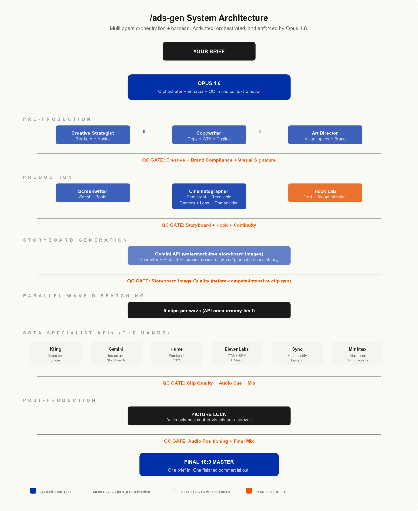

---

## The thesis

The harness engineering conversation has been entirely about external reviews enforcing deterministic output from probabilistic models. /ads-gen is an argument that the paradigm can be taken one step further: when given clearly defined rules, the orchestrator can also be the enforcer. And when the orchestrating model is capable of the sensor and QC work itself, it can monitor artifacts at every stage of the workflow. The same reasoning capacity that orchestrates the work can also judge the work, and doing both in one context window eliminates the serialization overhead of QC via external systems. Including the micro-decisions made to generate preference-heavy works, having self-justification would reduce unnecessary rigidity in QC.

/ads-gen is a full agent-to-agent orchestration system disguised as just another Claude Code skill. Persistent specialist agents, parallel dispatching and QC+refinement, picture-lock workflow, and automated tool routing across all SOTA media generation APIs. All of it lives in one skill file. All of it is activated, orchestrated, and enforced by one frontier model. The skill is the platform.

I refuse to believe that with a frontier system as powerful as Claude Code + Opus 4.6, the end game of human media creativity is still so trivial: ComfyUI or other node-based platforms helping with multi-input consistency, still hand-generating shot-by-shot on Higgsfield and friends, still hand-stitching clips in an NLE timeline. The street consensus loves the "innovation" because the comparison set is 2020, when the pre-production before pressing record required a crew and heavy logistics planning.

Going from a film crew to one creative with a clip generator feels game-changing on the surface. On the systems level, the surface has barely been scratched.

The path forward: let powerful models have better delegation, not just better prompts. Bound that delegation with human expert knowledge so the system produces craft, not slop. And generate logs at every stage so the harness learns, continuously, from its own production history.

---

## What it does

One brief in. One finished 16:9 commercial out.

In `dangerously-auto` mode, the entire pipeline runs without human intervention:

**Pre-production** → Creative strategy, copywriting, art direction, brand analysis, hook concepts

**Visual production** → Storyboard generation, character/product/location consistency, cinematography planning, video clip generation in parallel waves

**QC + refinement** → Multi-staged verification gates at every phase boundary. Failed artifacts are caught before expensive downstream steps run.

**Post-production** → Picture lock, audio scoring, sound design, voice-over, lipsync, final mix

**Output** → Finished 16:9 master

---

## System architecture

```
                          ┌─────────────────────┐
                          │     YOUR BRIEF       │
                          └──────────┬────────────┘
                                     │
                          ┌──────────▼────────────┐
                          │    OPUS 4.6            │
                          │    Orchestrator +      │
                          │    Enforcer            │
                          └──────────┬────────────┘
                                     │
              ┌──────────────────────┼──────────────────────┐
              │                      │                      │
    ┌─────────▼─────────┐ ┌─────────▼─────────┐ ┌─────────▼─────────┐
    │ Creative Strategy │ │  Art Direction     │ │   Copywriting     │
    │ Agent             │ │  Agent             │ │   Agent           │
    └─────────┬─────────┘ └─────────┬─────────┘ └─────────┬─────────┘
              │                      │                      │
              └──────────────────────┼──────────────────────┘
                                     │
                          ┌──────────▼────────────┐
                          │  QC GATE: Creative     │
                          │  (pass/fail/refine)    │
                          └──────────┬────────────┘
                                     │
              ┌──────────────────────┼──────────────────────┐
              │                      │                      │
    ┌─────────▼─────────┐ ┌─────────▼─────────┐ ┌─────────▼─────────┐
    │  Screenwriter     │ │  Cinematographer   │ │   Hook Lab        │
    │  Agent            │ │  Agent (persistent)│ │                   │
    └─────────┬─────────┘ └─────────┬─────────┘ └─────────┬─────────┘
              │                      │                      │
              └──────────────────────┼──────────────────────┘
                                     │
                          ┌──────────▼────────────┐
                          │  QC GATE: Storyboard   │
                          │  + Hook + Brand        │
                          └──────────┬────────────┘
                                     │
                          ┌──────────▼────────────┐
                          │  PARALLEL WAVE         │
                          │  DISPATCHING           │
                          │  (5 clips per wave)    │
                          └──────────┬────────────┘
                                     │
    ┌────────────┬───────────┬───────┼───────┬───────────┬────────────┐
    │            │           │       │       │           │            │
 ┌──▼──┐    ┌───▼──┐   ┌───▼──┐ ┌──▼──┐ ┌──▼──┐   ┌───▼──┐    ┌───▼──┐
 │Kling│    │Gemini│   │ Hume │ │Elev.│ │Sync │   │Mini. │    │Epid. │
 │Video│    │Image │   │ TTS  │ │Labs │ │Lip  │   │Music │    │SFX   │
 └──┬──┘    └───┬──┘   └───┬──┘ └──┬──┘ └──┬──┘   └───┬──┘    └───┬──┘
    │            │           │       │       │           │            │
    └────────────┴───────────┴───────┼───────┴───────────┴────────────┘
                                     │
                          ┌──────────▼────────────┐
                          │  QC GATE: Clip Quality │
                          │  + Audio + Mix         │
                          └──────────┬────────────┘
                                     │
                          ┌──────────▼────────────┐
                          │  PICTURE LOCK          │
                          └──────────┬────────────┘
                                     │
                          ┌──────────▼────────────┐
                          │  FINAL 16:9 MASTER     │
                          └────────────────────────┘
```

---

## Examples

All storyboards below were generated from a single brief, with no human intervention.

### ASICS City Chase

A running shoe commercial. Urban cinematography, product-as-protagonist, macro-to-hero arc.

| Shot 01 | Shot 05 | Shot 08 |
|---------|---------|---------|
| 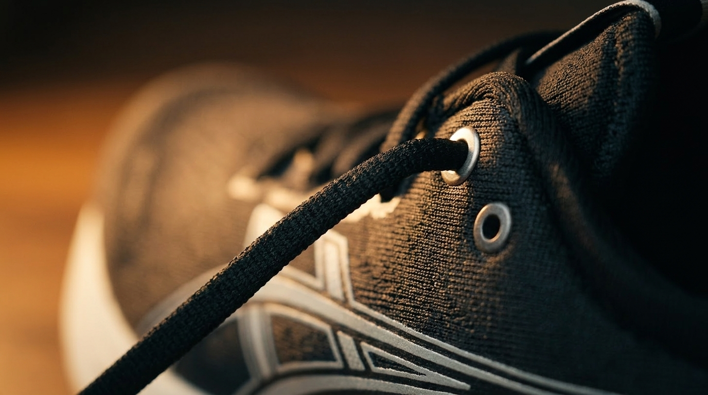 | 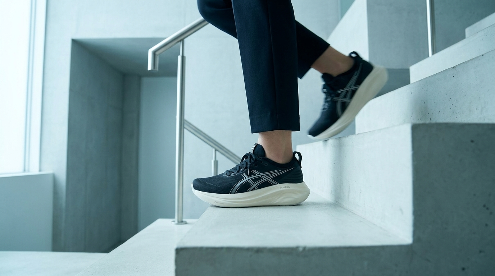 | 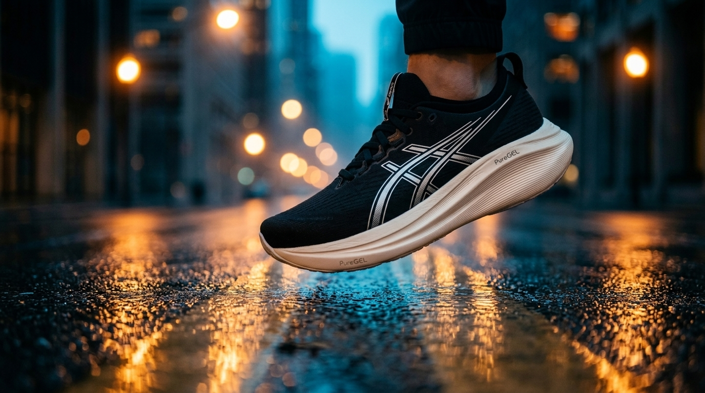 |

| Shot 10 | Shot 13 | Shot 15 |
|---------|---------|---------|
| 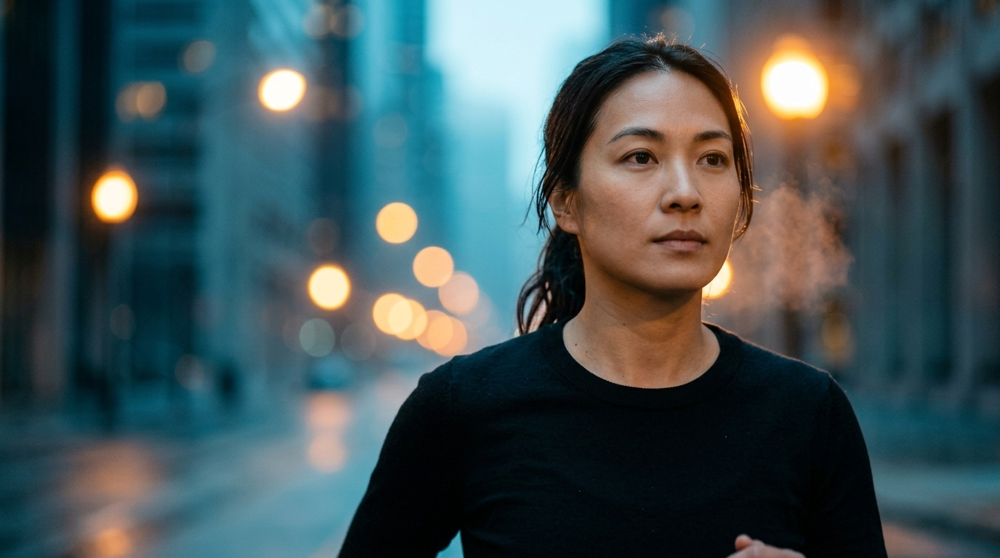 | 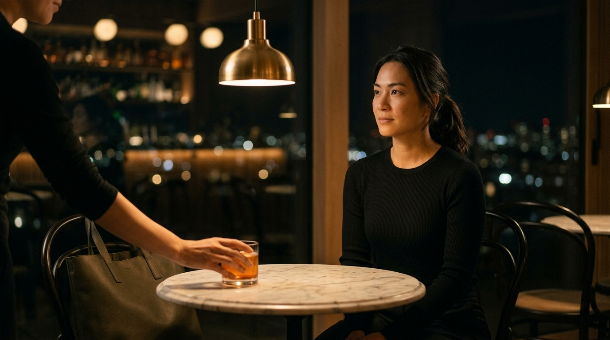 | 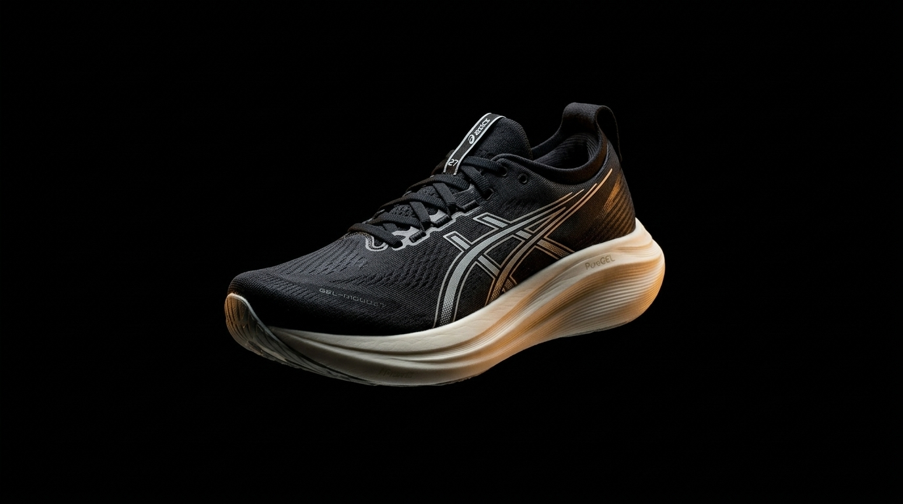 |

### Speed Dream

An electric scooter race ad. Raw documentary feel, crowd energy, night-lit arena finale.

| Shot 01 | Shot 04 | Shot 07 |
|---------|---------|---------|
| 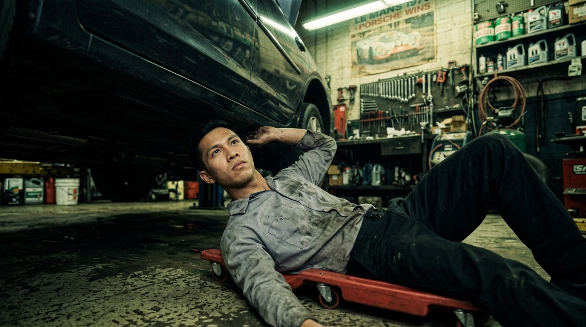 | 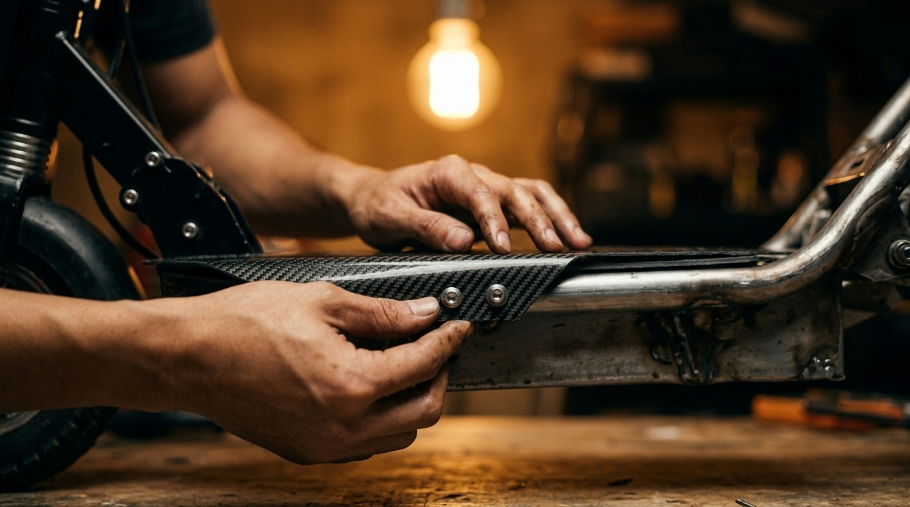 | 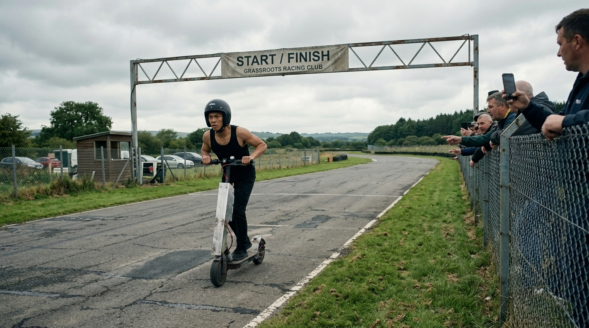 |

| Shot 10 | Shot 13 |
|---------|---------|
| 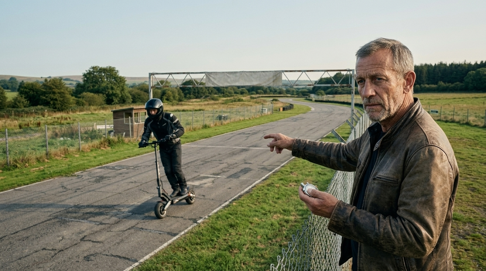 | 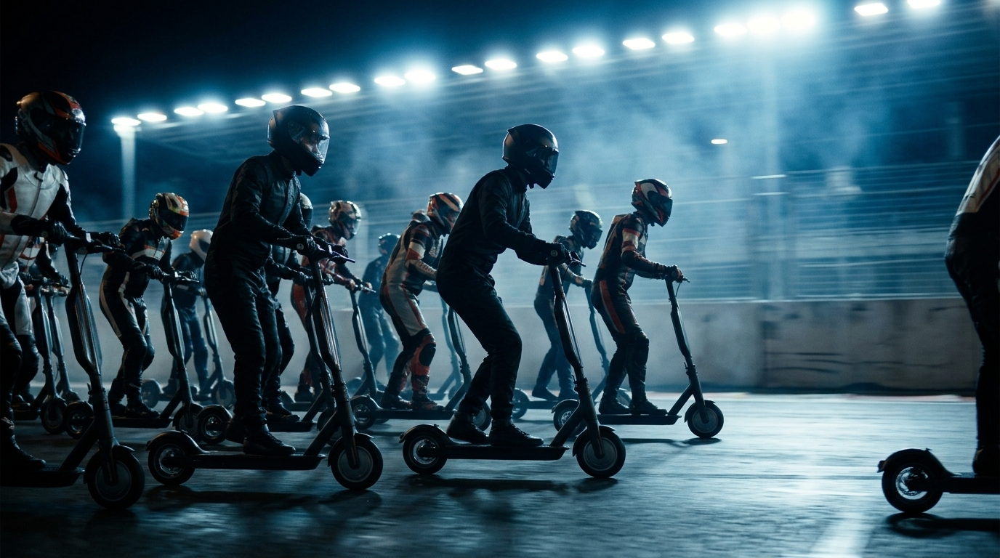 |

### Cold Latte Barista

A specialty coffee brand film. Warm interiors, golden hour, intimate craft storytelling.

| Shot 01 | Shot 05 | Shot 07 |
|---------|---------|---------|
| 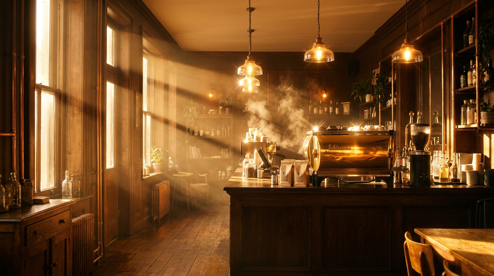 |  | 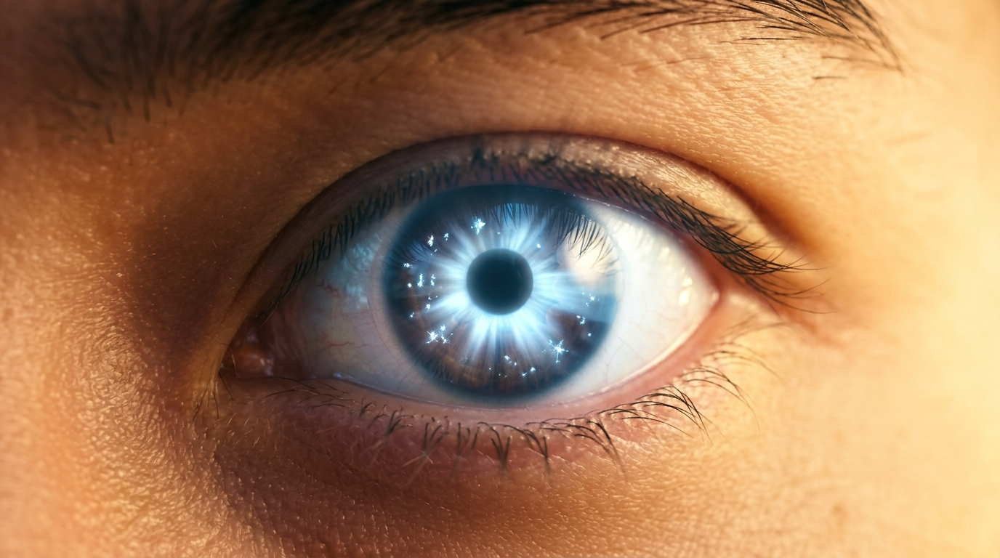 |

| Shot 10 | Shot 14 |
|---------|---------|
|  | 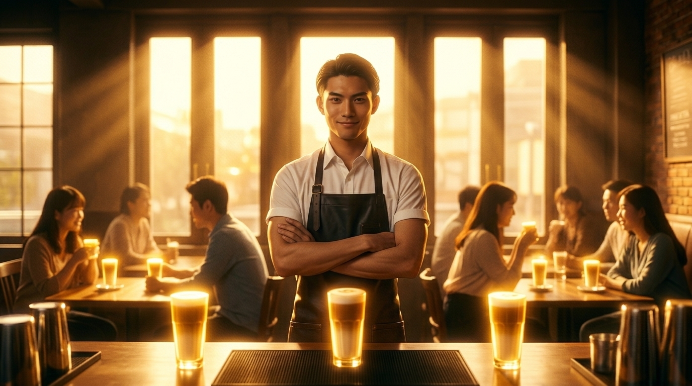 |

---

## Requirements

### Claude Code + Opus 4.6

This skill requires [Claude Code](https://claude.ai/code) running on Opus 4.6.

### API keys (BYOK)

This skill is BYOK (Bring Your Own Keys). You connect your own accounts to the SOTA specialist APIs. No middleman, no markup, no vendor lock-in.

| Key | Required for |
|-----|-------------|
| `KLING_ACCESS_KEY` + `KLING_SECRET_KEY` | Video generation, lipsync |
| `GEMINI_API_KEY` | Watermark-free storyboard images |
| `ELEVENLABS_API_KEY` | TTS, SFX, music |
| `HUME_API_KEY` | Emotional TTS |
| `MINIMAX_API_KEY` | Music generation, TTS fallback |
| `SYNC_API_KEY` | High-quality lipsync |

### Tools

- `ffmpeg` / `ffprobe`
- Node.js

---

## Install

```bash
curl -sL https://raw.githubusercontent.com/ioklmj1/ads-gen/main/scripts/install.sh | bash
```

This installs the skill file and all bundled tool scripts (Kling, Minimax, Gemini API wrappers). Everything the skill needs lives in one directory.

Or manually:

```bash
mkdir -p ~/.claude/skills/ads-gen/scripts/tools
curl -sL https://raw.githubusercontent.com/ioklmj1/ads-gen/main/SKILL.md -o ~/.claude/skills/ads-gen/SKILL.md
curl -sL https://raw.githubusercontent.com/ioklmj1/ads-gen/main/scripts/tools/kling-video.js -o ~/.claude/skills/ads-gen/scripts/tools/kling-video.js
curl -sL https://raw.githubusercontent.com/ioklmj1/ads-gen/main/scripts/tools/minimax-audio.js -o ~/.claude/skills/ads-gen/scripts/tools/minimax-audio.js
curl -sL https://raw.githubusercontent.com/ioklmj1/ads-gen/main/scripts/tools/gemini-api.js -o ~/.claude/skills/ads-gen/scripts/tools/gemini-api.js
curl -sL https://raw.githubusercontent.com/ioklmj1/ads-gen/main/scripts/tools/gemini-upload.js -o ~/.claude/skills/ads-gen/scripts/tools/gemini-upload.js
```

Then open Claude Code and type `/ads-gen` followed by your brief.

---

## Usage

### Interactive mode (recommended for first run)

```
/ads-gen

Brief: 30-second spot for a premium running shoe. Urban setting,
dawn light, one runner, product hero at the end.
```

The system will walk you through creative decisions: genre, duration, music mood, dialogue style.

### Dangerously-auto mode

```
/ads-gen

Full auto. 30-second spot for a premium running shoe. Urban setting,
dawn light, one runner, product hero at the end.
```

Zero interaction. One brief in, one finished master out.

---

## How it works

1. **Opus reads the skill file** containing the full orchestration protocol, specialist agent definitions, QC criteria, and domain expertise
2. **Opus activates the agents** in sequence and parallel, dispatching work to specialists
3. **Agents communicate** with each other: the Cinematographer is persistent and recallable, the Art Director and Copywriter negotiate, QC agents review upstream work
4. **Verification gates block phase advancement** until artifacts pass quality criteria
5. **External SOTA APIs do the hands**: Kling generates video, Gemini generates images, Hume/ElevenLabs generate voice, Minimax generates music, Sync handles lipsync
6. **Opus enforces the harness**: the same model that orchestrates also judges, filtering waste at every stage before expensive compute runs

---

## The paradigm

The future is always in the middle. Slop on one side, Snob on the other, taste at scale in between. This skill, and this paradigm, is the middle.

---

## License

See [LICENSE](LICENSE) for details.
